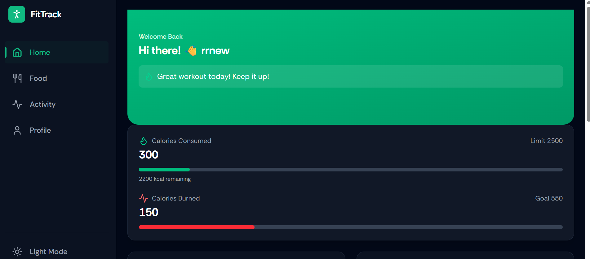
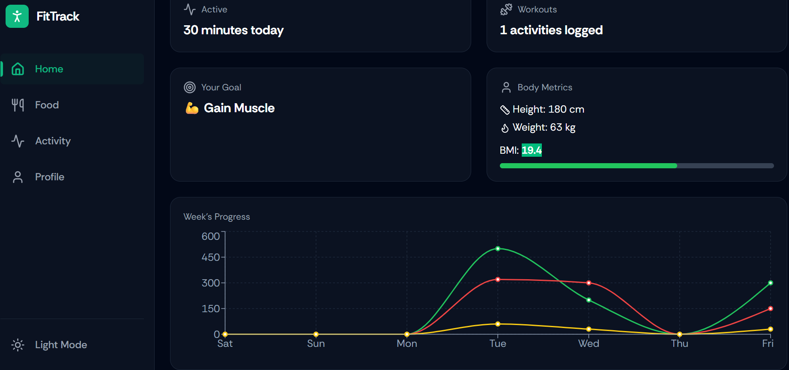
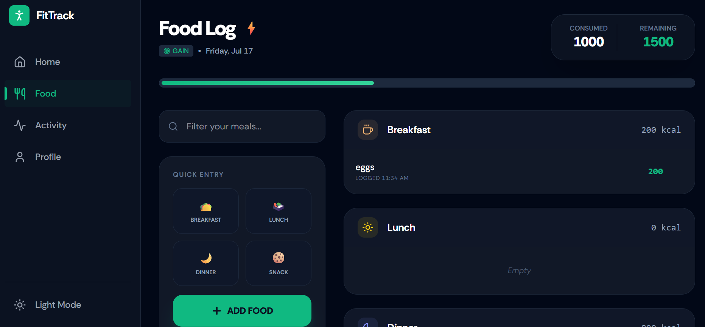
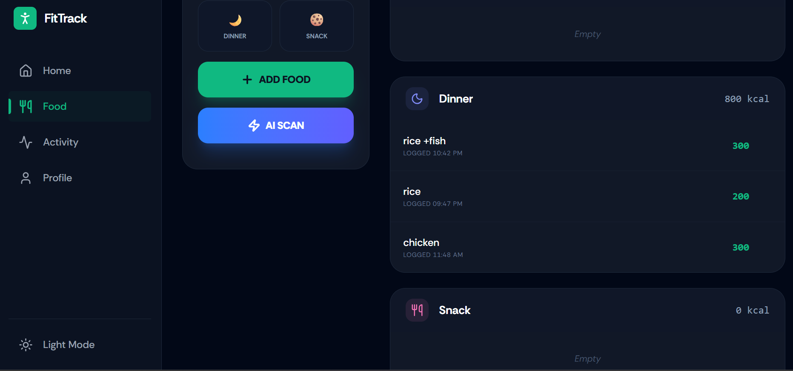

# AI-Powered Fitness & Nutrition Tracker 🏋️‍♂️🥗

A full-stack web application designed to help users track their daily fitness metrics while leveraging artificial intelligence to analyze food imagery for instant nutritional breakdowns. 

## ✨ Key Features

* **AI Food Analysis:** Upload an image of your meal, and the application uses Google Gemini AI to estimate the calories and macronutrient breakdown.
* **Interactive Dashboards:** Visualizes BMI, weekly workout progression, and daily caloric trends using Recharts.
* **Secure User Authentication:** Protected routes and session management utilizing JWT.
* **Personalized Tracking:** Users can log their daily workouts and meals, backed by a fast and lightweight SQLite database.

## 🛠️ Tech Stack

* **Frontend:** React.js, TypeScript, Tailwind CSS, Recharts, Vite
* **Backend:** Node.js, Strapi (Headless CMS)
* **Database:** SQLite
* **AI Integration:** Google Gemini AI API

## 📂 Project Structure

This repository is a monorepo containing both the frontend client and the backend server:

* `/server`: The Strapi backend and SQLite database configurations.
* `/vite-project`: The React.js frontend built with Vite.

## 📸 Screenshots

### Interactive Analytics Dashboard



### AI-Powered Food Logging



## 🚀 Getting Started

Follow these instructions to set up both the backend and frontend locally on your machine.

### Prerequisites
* Node.js (v18 or higher)
* npm or yarn

### 1. Backend Setup (Strapi Server)

Navigate to the server directory, install dependencies, and configure your environment.

```bash
cd server
npm install
